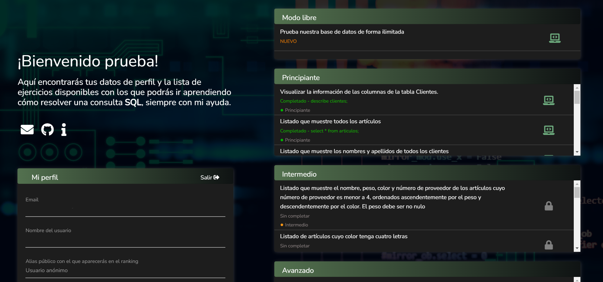
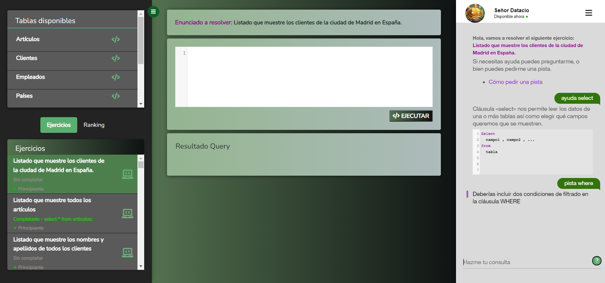
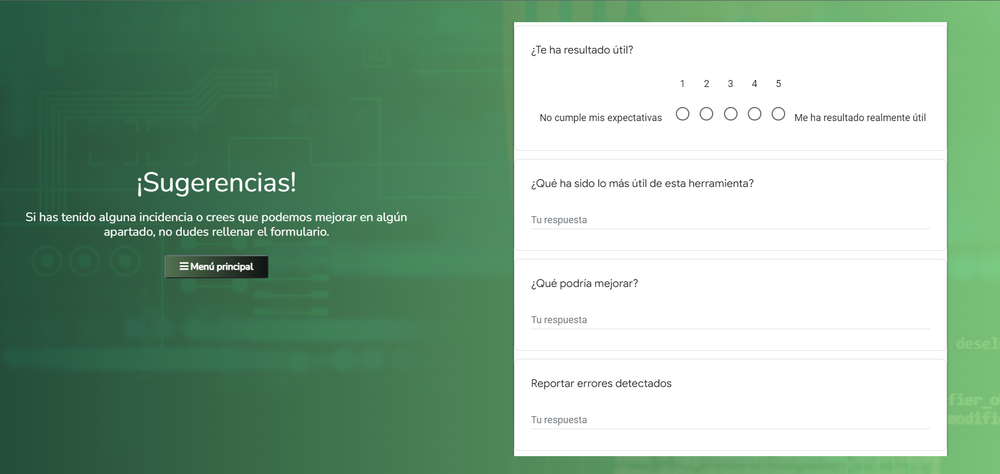

# ChatbotSQL
 
## Introducción

ChatbotSQL es una plataforma web educativa para aprender SQL mediante la resolución de pequeños ejercicios. Esta aplicación podrá brindar el apoyo necesario a cada alumno, gracias a su asistente virtual, creado con IBM Watson.

Con esta plataforma pretendemos mejorar la experiencia de aprendizaje de los alumnos de la asignatura de Bases de Datos de la Universidad de Cádiz, al mismo tiempo que analizamos los errores y dudas más frecuentes entre los usuarios.

## Descripción

### Menú principal:

Una vez iniciamos sesión, podemos escoger entre realizar ejercicios o probar el modo libre:

- Con los ejercicios podrán poner a prueba sus habilidades. Existen tres niveles de dificultad, que se irán desbloqueando conforme vayamos resolviendo ejercicios más sencillos.
- En el modo libre, los usuarios pueden experimentar con sus propias consultas, sin seguir las indicaciones de ningún ejercicio.

### Pantalla de juego:

Cuando seleccionamos un ejercicio o el modo libre, veremos una pantalla con tres zonas diferenciadas:
- A la izquierda, dos paneles. En el primero, podemos ver el contenido de las tablas sin necesidad de hacer nosotros la consulta. En el segundo, podemos seleccionar el ejercicio al que queremos ir, o ver los alumnos que han resuelto el ejercicio en el que nos encontramos.

- En la parte central tenemos la zona en la que escribimos nuestra consulta, y la zona en la que veremos la tabla resultante.

- A la derecha, tenemos el asistente virtual, que nos irá informando de cualquier fallo. También podremos preguntarle directamente en caso de necesitarlo.

### Contacto:
En la pestaña de contacto podemos notificar errores que hayamos encontrado, así como valorar la aplicación.

## Sobre el proyecto

Este proyecto ha sido financiado en la convocatoria de Innovación Docente de la Universidad de Cádiz 2021/22 “Proyecto de Innovación Docente de la UCA" (código sol-202100203360-tra).

Han participado en este proyecto:
- Antonio Balderas
- Daniel Mejías
- Andrés Muñoz
- Manuel Palomo
- Rubén Pérez
- Juan Francisco Cabrera

---
---
 
## Introduction

ChatbotSQL is an educational platform to learn SQL by solving exercises. This app will be able to help students thanks to our virtual assistant, created with IBM Watson.

With this platform, we try to improve the learning experience of Databases subject students at University of Cádiz, at the same time that we analyze the most common mistakes and questions.

## Description

### Main Menu:

Once we log in, we can choose between doing exercises or trying the playground mode.

- The exercises will test the user's skills. There are three difficulty levels, which will be unlocked when we solve all the exercises from the previous level.
- The playground mode will allow users to perform some queries freely.

### Game tab:

When we select an exercise or the playground mode, we will see three panels: 
- On the left, we can see the data stored in the database without performing a query. We can also select another problem, and check the students that have completed the current exercise.

- In the middle, we have the text area, in which we have to write the query. The result of the query will appear here too.

- On the right, we have our virtual assistant. It will give us some information.

### Contact:
In this tab we can report the errors we may find. We can also rate the app.

## About the project

This project has been funded in the call of Teaching Innovation of the University of Cádiz 2021/22 “Proyecto de Innovación Docente de la UCA" (code sol-202100203360-tra).

The following people have taken part in this project:
- Antonio Balderas
- Daniel Mejías
- Andrés Muñoz
- Manuel Palomo
- Rubén Pérez
- Juan Francisco Cabrera